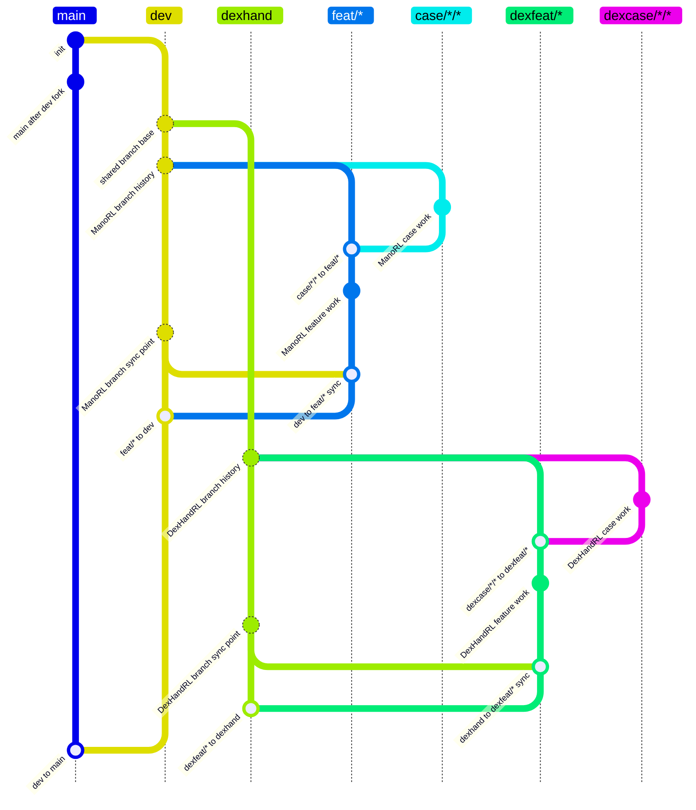

# ManoRL / DexHandRL Pi Task Flow

## Rules

- `main` is the literal release branch. It accepts only merges from `dev` and never direct commits.
- `dev` is the protected ManoRL integration branch. It accepts only `feat/*` merges and never direct commits.
- `dexhand` is the protected DexHandRL integration branch. It accepts only `dexfeat/*` merges and never direct commits.
- `feat/*` branches from `dev`, may receive `case/*/*` merges, and may merge only into `dev` after merging the current `dev` into the feature branch.
- `case/*/*` means `case/<context>/<topic>`. It branches from `dev`, may merge only into `feat/*`, and never directly into `dev` or `main`.
- `dexfeat/*` branches from `dexhand`, may receive `dexcase/*/*` merges, and may merge only into `dexhand` after merging the current `dexhand` into the feature branch.
- `dexcase/*/*` means `dexcase/<context>/<topic>`. It branches from `dexhand`, may merge only into `dexfeat/*`, and never directly into `dexhand`, `dev`, or `main`.
- Direct commits are permitted only on task branches: `feat/*`, `case/*/*`, `dexfeat/*`, and `dexcase/*/*`.
- One task has one branch, one linked worktree, and one Pi session.
- ManoRL Pi names are `manorl-feat-<topic>` and `manorl-case-<context>--<topic>`.
- DexHandRL Pi names are `dexhand-feat-<topic>` and `dexhand-case-<context>--<topic>`.
- Case worktree keys use a double hyphen between independently hyphenated context and topic components.
- Pi names are display/intercom names, not Git refs.
- GitGuard is a local accidental-workflow guard, not a security boundary.
