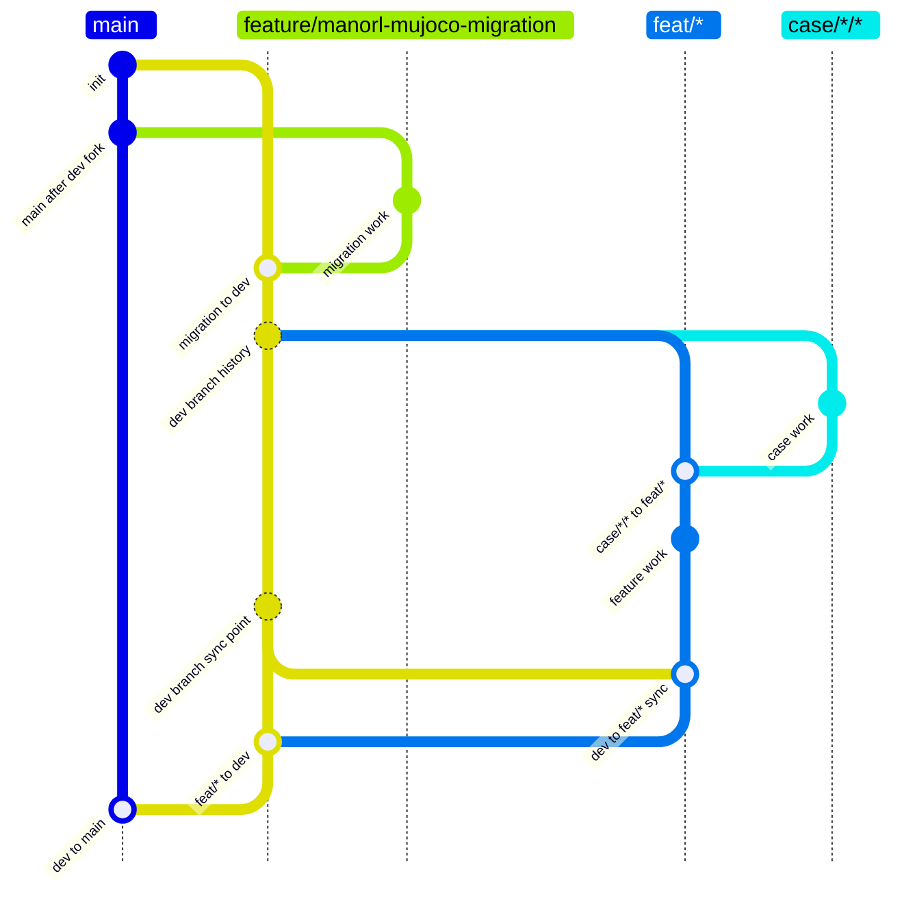

# ManoRL Pi Task Flow

## Rules

- `main` is the literal release branch. It accepts only merges from `dev` and never direct commits.
- `dev` is the literal protected integration branch. It branches from `main`, accepts only `feat/*` merges and the temporary `feature/manorl-mujoco-migration` merge, and never direct commits.
- `feat/*` branches from `dev`, may receive `case/*/*` merges, and may merge only into `dev` after merging the current `dev` into the feature branch.
- `case/*/*` means `case/<context>/<topic>`. It branches from `dev`, may merge only into `feat/*`, and never directly into `dev` or `main`.
- Direct commits are permitted only on `feat/*`, `case/*/*`, and the temporary `feature/manorl-mujoco-migration` branch.
- `feature/manorl-mujoco-migration` branches from `main` and may merge only into `dev`. Remove it from this policy after migration adoption.
- One task has one branch, one linked worktree, and one Pi session.
- Pi names are `manorl-feat-<topic>` for features and `manorl-case-<context>--<topic>` for cases; case worktree keys are `case-<context>--<topic>`. The double hyphen separates independently hyphenated components. A Pi name is a display/intercom name, not a Git ref.
- GitGuard is a local accidental-workflow guard, not a security boundary.
