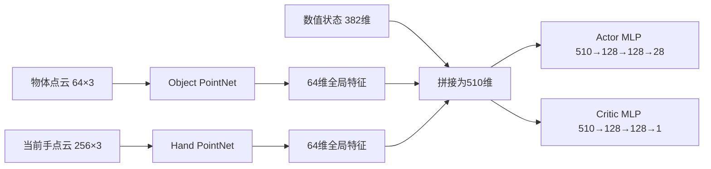
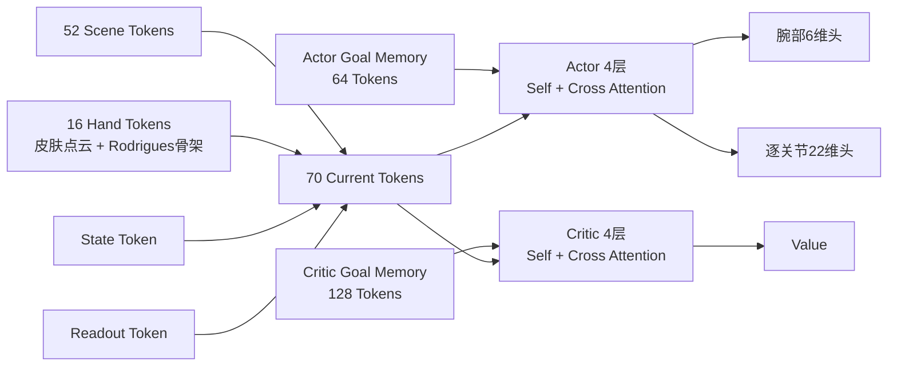
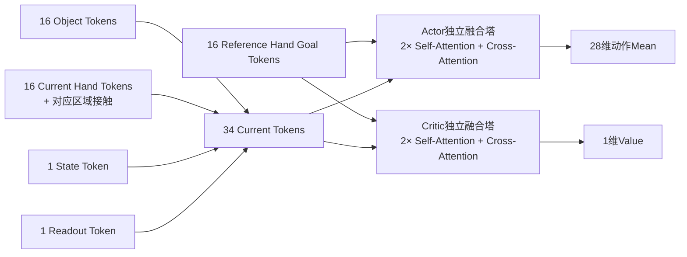

# 两个 v5 架构与 ManoRL v6 架构记录

状态：2026-09-19 已完成代码命名和架构实现。本文中的“两个 v5”分别指：

1. **ManoRL v5-pointcloud**：`mujoco-warp-contactbench` 的
   `case/contact-conditioned-autonomy/v5-pointcloud`；
2. **VoxMani v0.5**：`voxMani` 的
   `case/auton-policy/v05-force-obs`，下文简称 **VoxMani v5**。

在此前开发中暂称为 `v5.1-pointcloud` 的混合架构，从本版本起正式命名为：

> **ManoRL v6 Region-Token Cross-Attention Policy**

对应版本标识为：

```text
CLI policy version:   v6
Observation contract: manorl.autonomy.observation.v6.region-token-cross-attention
Checkpoint format:    manorl.autonomy.ppo.v6
Model architecture:   manorl.autonomy.actor_critic.v6.region-token-cross-attention
```

## 1. 三个版本的定位

| 项目 | ManoRL v5-pointcloud | VoxMani v5 | ManoRL v6 |
|---|---|---|---|
| 主要目标 | 用点云替换手工接触几何 | 完整时空Token策略 | 在现有ManoRL训练管线中引入区域Token和目标注意力 |
| 原始观测宽度 | 1342 | 796 | 2205 |
| 参数量 | 285,753 | 4,517,173 | 1,780,025 |
| 物体表达 | 64点全局PointNet | 16细粒度Patch + 4粗粒度Patch | 16个物体Patch Token |
| 手部表达 | 256点全局PointNet | 16个骨骼皮肤Token + Rodrigues骨架流 | 16个手部区域Token |
| 目标表达 | 数值参考；参考手云未进入网络 | Actor 64个、Critic 128个Goal Token | 16个同帧参考手Goal Token |
| 当前Token数量 | 无显式Token集合 | 70 | 34 |
| Attention | 无 | 4层Self + Cross Attention | Actor/Critic各2层Self + Cross Attention |
| Actor/Critic | 可共享或分离MLP | 完全独立双塔 | 共享观测Token编码器，融合塔独立 |
| 动作头 | 统一28维线性头 | 腕部6维 + 逐关节22维 | 统一28维线性头 |
| 策略分布 | Raw Gaussian + Clip | Tanh-squashed Gaussian | Raw Gaussian + Clip |
| PPO | ManoRL/skrl PPO | VoxMani自定义PPO | 保留ManoRL/skrl PPO |
| 奖励 | ManoRL Reward v10路线 | VoxMani奖励/MDP | 保留ManoRL Reward v10路线 |

## 2. ManoRL v5-pointcloud

### 2.1 观测

ManoRL v5-pointcloud 的1342维观测为：

| 观测块 | 维度 |
|---|---:|
| 当前状态 | 119 |
| 当前参考状态 | 109 |
| 未来数值参考 | 12 |
| 接触意图与逐区域力 | 80 |
| 物体点云 `64×3` | 192 |
| 当前手点云 `256×3` | 768 |
| 动作类别 | 50 |
| 物体几何 | 12 |
| 合计 | **1342** |

其中接触块为：

```text
reference confidence  16
reference valid       16
paired force xyz      48
```

### 2.2 网络



### 2.3 局限

- 256个手点被一次全局池化，16个手部区域身份丢失；
- 接触力无法与具体手指/骨骼Token绑定；
- `hand_cloud_reference` 已经由缓存编译，但没有进入观测和网络；
- 当前手型与参考手型之间没有Cross-Attention；
- 接触力使用固定 `tanh(force / 5N)`，大力区域容易饱和；
- slip通道被删除；
- 原始提交只增加了观测构造器和模型类，正式训练管线当时仍主要走v4。

## 3. VoxMani v5

### 3.1 观测与Token

VoxMani v5 使用796维紧凑ABI，在Torch侧展开为三个主要Head：

1. **Head 1：场景Token**
   - 当前物体16个细粒度Patch；
   - 桌面16个Patch；
   - 过去5帧，每帧4个物体粗粒度Patch；
   - 合计52个Scene Token。
2. **Head 2：手部Token**
   - 16个骨骼区域；
   - 每个骨骼16个表面点；
   - 皮肤点云Token与Neural Rodrigues骨架流融合。
3. **Head 3：目标Token**
   - Actor：16个目标时刻 × 4个粗粒度Patch = 64个Token；
   - Critic：32个目标时刻 × 4个粗粒度Patch = 128个Token。

当前集合为：

```text
52 Scene + 16 Hand + 1 State + 1 Readout = 70 Tokens
```

### 3.2 网络



主要网络参数为：

```text
model_dim = 128
attention_heads = 4
FFN_dim = 512
trunk_layers = 4
actor/critic = 完全独立双塔
```

### 3.3 力观测

VoxMani v5增加60维物体侧受力分解：

```text
gravity                  3
per-bone hand force     48
hand torque              3
other force              3
other torque             3
```

力使用 `F / (m|g|)`，力矩使用 `τ / (m|g|r)` 归一化，不使用固定5N裁剪。

## 4. ManoRL v6

### 4.1 设计边界

v6不是把VoxMani整套环境和PPO直接复制过来，而是在保持当前ManoRL
MDP、奖励、控制和训练基础设施不变的情况下，迁移其更适合接触抓取的
观测组织与Token融合思想。

保持不变：

- MuJoCo/MJX-Warp环境和终止语义；
- Reward v10混合奖励；
- 当前PPO/GAE和teacher anchor；
- 28维动作空间；
- rate-limited measured-state命令；
- anti-windup；
- Raw Gaussian概率模型和物理动作裁剪；
- 自然首次终止评估边界。

### 4.2 2205维观测

| 观测块 | 维度 | 来源 |
|---|---:|---|
| 当前状态 | 119 | ManoRL v5 |
| 当前参考状态 | 109 | ManoRL v5 |
| 未来数值参考 | 12 | ManoRL v5 |
| 16区域接触观测 | 160 | VoxMani区域力思想 + ManoRL contact reducer |
| 物体Wrench | 15 | VoxMani物体侧受力分解 |
| 物体点云 | 192 | ManoRL v5 |
| 当前手点云 | 768 | ManoRL v5 |
| 参考手点云 | 768 | 激活ManoRL v5缓存中未使用的数据 |
| 动作类别 | 50 | ManoRL v5 |
| 物体几何 | 12 | ManoRL v5 |
| 合计 | **2205** | |

每个手部区域有10维绑定特征：

```text
reference confidence      1
reference valid           1
measured contact active   1
log1p(contact count)      1
paired force xyz          3
tangential slip xyz       3
```

物体Wrench为15维：

```text
gravity                  3
summed hand force        3
summed hand torque       3
non-hand force           3
non-hand torque          3
```

力在当前物体坐标系表达，并按 `m|g|` 归一化；力矩按 `m|g|r` 归一化。
动态力和力矩使用 `asinh` 压缩，以保留大接触冲量的相对差异。

### 4.3 Token编码

```text
物体：64点 → 16组×4点 → Point Stem → 16 Object Tokens
当前手：16区域×16点 → Hand Stem → 16 Current Hand Tokens
参考手：16区域×16点 → 同一Hand Stem → 16 Goal Hand Tokens
数值状态：317维 → 256 → 128 → 1 State Token
另有1个可学习Readout Token
```

当前Token集合：

```text
16 Object + 16 Current Hand + 1 State + 1 Readout = 34 Tokens
```

目标Memory：

```text
16 Reference Hand Tokens
```

区域接触特征经过 `10→128` 投影后，只加入同编号的当前手Token。例如第5区域
的接触力只改变第5个手部Token，不再在全局池化中丢失身份。

### 4.4 Actor/Critic



网络参数：

```text
raw observation = 2205
model_dim = 128
attention_heads = 4
FFN_dim = 512
fusion_layers = 2
current_tokens = 34
goal_tokens = 16
trainable parameters = 1,780,025
```

Actor和Critic共享观测Token编码器，包括Point Stem、区域/patch embedding、
接触投影和State MLP；进入Attention融合阶段后使用相互独立的两座塔。

## 5. v6分别借鉴了什么

### 5.1 从ManoRL v5-pointcloud继承

- 当前119维物理状态和109维参考状态；
- 6/12/24帧未来物体数值参考；
- 64点物体点云；
- 16区域×16点当前手点云；
- 动作类别和物体几何编码；
- 已编译的参考手点云缓存；
- MuJoCo/MJX-Warp环境、Reward v10、PPO和动作控制管线；
- checkpoint严格ABI和provenance检查。

### 5.2 从VoxMani v5借鉴

- 将64个物体点组织为16个局部Patch Token；
- 将256个手点保留为16个骨骼/区域Token；
- 为区域和Patch加入身份embedding；
- 将接触力绑定到对应手部区域，而不是全局拼接；
- 使用目标Memory和Cross-Attention表达“当前状态应向哪里变化”；
- Actor/Critic使用独立的融合塔；
- 使用物体侧手力、其他力以及关于COM的力矩分解；
- 使用 `m|g|` 和 `m|g|r` 进行物理尺度归一化；
- 采用128维、4头、512维FFN这一经过验证的Attention尺度。

### 5.3 v6对两个v5的再设计

- ManoRL v5的全局手PointNet改为16个区域Token；
- 原先未使用的参考手云正式成为Cross-Attention目标；
- ManoRL v5删除的slip重新作为逐区域观测加入；
- 固定 `tanh(force/5N)` 改为质量/重力/半径归一化与 `asinh`；
- 不复制VoxMani庞大的时空场景和多时刻Goal集合，只使用当前任务最直接的
  同帧参考手目标；
- Attention层数从4层减到2层，将参数量控制在VoxMani v5的约39%；
- 第一阶段保留ManoRL统一28维动作头，避免同时改变观测、注意力和动作头；
- 第一阶段保留Raw Gaussian + Clip，Tanh-squashed Gaussian作为后续独立消融。

## 6. 明确没有从VoxMani v5迁移的部分

- 桌面16个Patch Token；
- 过去5帧物体粗粒度Token；
- Actor 64 / Critic 128个多时刻Goal Token；
- Neural Rodrigues骨架流；
- Critic专用13维privileged observation；
- 腕部6维和逐关节22维分离动作头；
- Tanh-squashed Gaussian；
- VoxMani自定义双优化器PPO；
- BF16、goal reuse、CUDA graph等训练优化。

这些内容如果后续需要引入，应分别做消融实验，不能与v6首轮观测改动同时加入，
否则无法判断性能变化来自哪一部分。

## 7. 代码位置与使用

核心代码：

```text
sim/manorl/autonomy_v6_model.py
sim/manorl/autonomy_v4.py::build_raw_observation_v6
sim/manorl/autonomy_contracts.py
sim/manorl/autonomy_batch.py
sim/manorl/autonomy_training.py
tools/train_manorl_autonomy.py
tests/manorl/test_autonomy_v6.py
```

显式选择v6：

```bash
python tools/train_manorl_autonomy.py inspect \
  --policy-version v6 \
  --device cpu \
  --num-envs 1 \
  --package /path/to/package \
  --identity cube2_02_2833
```

v4仍是兼容默认值。v4、ManoRL v5和v6具有不同的观测与checkpoint ABI，
不得互相强制加载权重。
